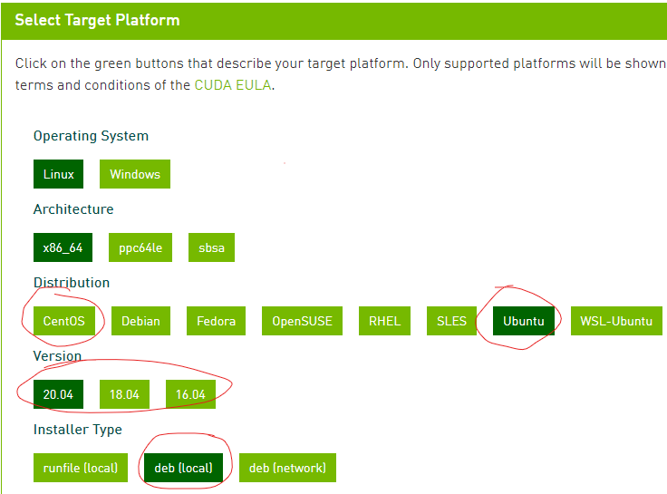

# Manuals

## Install a Server

### Download OS Image (.iso)

* **Ubuntu** (Debian): https://ubuntu.com/download/server
* **CentOS** (RHEL): https://www.centos.org/download/

### Burn the Image into Bootable USB Device

* Download **Rufus**: https://rufus.ie/
* Select .iso and use default options:


Wait for complete.

### Installation

* On system boot, invoke the boot menu and select your USB.
* Install with almost default settings. Be careful to choose disk to install.
* In most cases, don't create LVM group when formatting the disk.

## First-Run

### Setup Network

```console
user@host:~$ sudo vim /etc/netplan/00-installer-config.yaml
```
Modify like this:
```
network:
  ethernets:
    eno1:
      dhcp4: no
      addresses: [192.168.1.X/24]
      gateway4: 192.168.1.1
      nameservers:
        addresses: [223.5.5.5,8.8.8.8]
  version: 2
```

This set network to use static IP, in order to use NAT.

Then apply changes:
```console
user@host:~$ sudo netplan apply
```

### Setup SSH Server

```console
user@host:~$ sudo vim /etc/ssh/sshd_config
```
Useful settings:
```
Port XXXX                    # SSH server listening port
UseDNS no
GSSAPIAuthentication no      # These two settings make SSH connection faster
PermitRootLogin no           # Prohibit root login
Match User admin,ubuntu      # Per-User settings
       PasswordAuthentication no
```
Restart SSH to apply changes.
```console
user@host:~$ sudo service sshd restart
```

### Mounting Disks

List disks
```console
user@host:~$ sudo fdisk -l
Disk /dev/loop0: 29.9 MiB, 31334400 bytes, 61200 sectors
Units: sectors of 1 * 512 = 512 bytes
Sector size (logical/physical): 512 bytes / 512 bytes
I/O size (minimum/optimal): 512 bytes / 512 bytes


Disk /dev/loop1: 54.98 MiB, 57626624 bytes, 112552 sectors
Units: sectors of 1 * 512 = 512 bytes
Sector size (logical/physical): 512 bytes / 512 bytes
I/O size (minimum/optimal): 512 bytes / 512 bytes


Disk /dev/loop2: 71.28 MiB, 74735616 bytes, 145968 sectors
Units: sectors of 1 * 512 = 512 bytes
Sector size (logical/physical): 512 bytes / 512 bytes
I/O size (minimum/optimal): 512 bytes / 512 bytes


Disk /dev/sdb: 7.28 TiB, 8001563222016 bytes, 15628053168 sectors
Disk model: HGST HUS728T8TAL
Units: sectors of 1 * 512 = 512 bytes
Sector size (logical/physical): 512 bytes / 4096 bytes
I/O size (minimum/optimal): 4096 bytes / 4096 bytes
Disklabel type: gpt
Disk identifier: 41426009-6523-4E08-AEB4-3E0F118F50CF

Device     Start         End     Sectors  Size Type
/dev/sdb1   2048 15628053134 15628051087  7.3T Linux filesystem


Disk /dev/sda: 894.26 GiB, 960197124096 bytes, 1875385008 sectors
Disk model: SAMSUNG MZ7LH960
Units: sectors of 1 * 512 = 512 bytes
Sector size (logical/physical): 512 bytes / 4096 bytes
I/O size (minimum/optimal): 4096 bytes / 4096 bytes
Disklabel type: gpt
Disk identifier: 50B12219-3E72-4376-A057-5922B0C432B9

Device       Start        End    Sectors   Size Type
/dev/sda1     2048    1050623    1048576   512M EFI System
/dev/sda2  1050624 1875382271 1874331648 893.8G Linux filesystem
```

For example, you want to mount /dev/sdb1 (7.3T HDD disk), edit `/etc/fstab`
```console
user@host:~$ sudo vim /etc/fstab
```

Append a line:
```
/dev/sdb1 /mnt/hdd1 ext4 defaults 0 0
```
It configs device, mounting point, file system and other mounting configs, repectively.

To validate config is correct, do:
```console
user@host:~$ sudo mount -a
```

**NOTE**:
In order to use our script properly, you should mount in `/mnt/`, for example: `/mnt/hdd1`, `/mnt/hdd2`, `/mnt/ssd`.


### Drivers

https://developer.nvidia.com/cuda-downloads

Select correct OS, version and **don't** use `.run` runfile to install.



Follow the commands to install, and reboot.


### Mirrors

* Change `apt` or `yum` repos to [Aliyun](https://developer.aliyun.com/mirror/), or [Tuna](https://mirrors.tuna.tsinghua.edu.cn/).
* Also change `Pypi`, `Conda`, etc.


## Administration

**Please use the script carefully.**

### Create a New User

```console
user@host:~$ sudo sh newuser.sh [username] [password]
```

### Automatically Reset Owner in a Directory

```console
user@host:~$ find . -maxdepth 1 -type d | sudo bash ~/set.sh
```

### Add a User to Sudoers

In Ubuntu or Debian:
```console
user@host:~$ sudo usermod -aG sudo USERNAME
```

In CentOS or RHEL:
```console
user@host:~$ sudo usermod -aG wheel USERNAME
```
